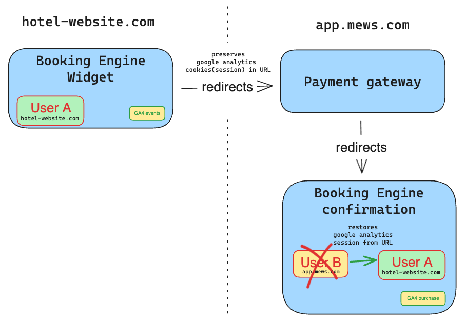
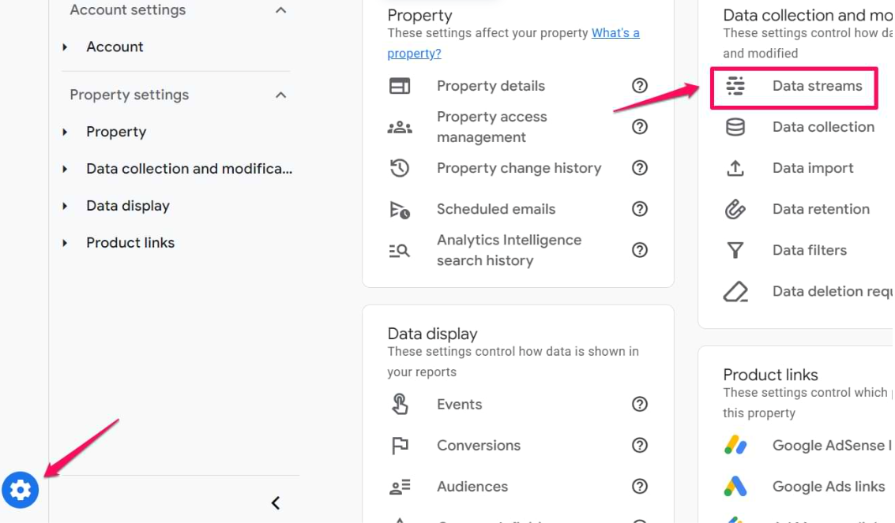
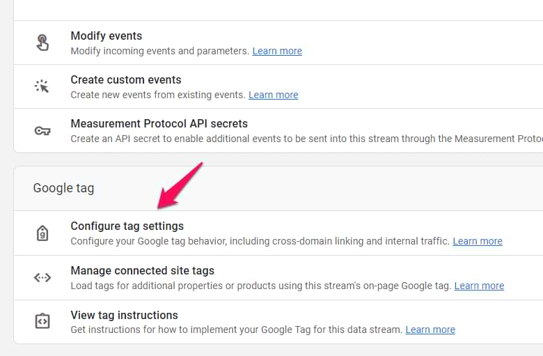
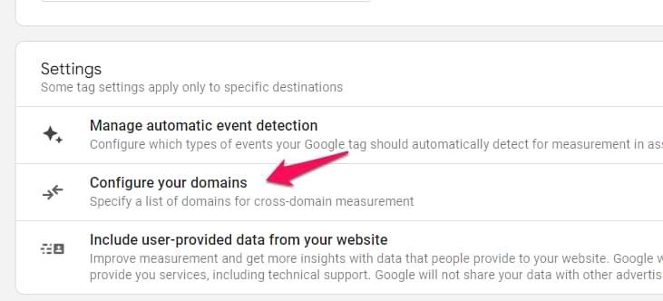
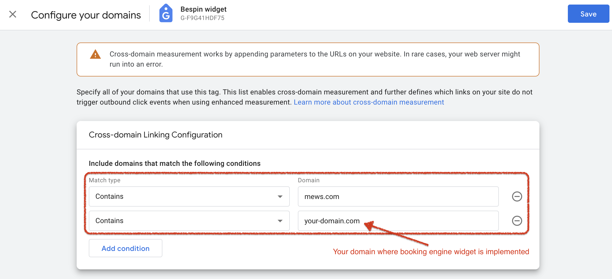

# Google analytics cross-domain tracking

> **Notice of usage:** Google Tag Manager (GTM) and Google Analytics 4 (GA4) are third party services and we provide this integration as is.
We support a set of custom events and Data Layer variables for use with GTM and GA4, however we have no control over what happens to them and how they are used. The basic setup examples we provide have been tested and verified to work with the Mews Booking Engine, however if you need a more complex setup then we cannot provide the support to do so and we recommend to ask a specialist to set it up and test it for you.

## What is cross-domain tracking?

In Google Analytics 4 (GA4), cross-domain tracking is a way of tracking user activity across multiple domains, e.g. across a customer website and a shopping cart. Without configuring cross-domain tracking, Google will create new cookies for each visit and think that it is two users and two sessions, instead of just the same user in the same session.

## Why is it important?

Google Analytics 4 (GA4) requires cross-domain tracking configuration to accurately track user interactions that span across different domains. Without this configuration, a visitor who completes a booking with a payment through a widget hosted on another domain would be tracked incorrectly. This visitor would appear as two separate users in Google Analytics, resulting in disjointed sessions. Additionally, the referral source attribution would be compromised, potentially misrepresenting the origin of the traffic. Essentially, cross-domain tracking in GA4 ensures that the user journey and source data are correctly linked and reported, even when transactions or interactions occur across multiple domains.

"For the booking engine widget, the `_gl` Google Linker query parameter has been implemented to maintain session continuity. Below is an illustration of how it functions."

## How to configure cross-domain tracking in Google Analytics 4?

#### Step #1. Go to the Admin of Google Analytics > Data Streams and select web data stream
Ensure you choose the correct web data stream associated with your site.

#### Step #2 and #3: Go to 'Configure Tag Settings' and then click on 'Configure your domains'
Here, you will adjust settings to include any domains involved in the user journey, ensuring continuity in tracking sessions across different domains.

#### Step #4: Enter all domains involved in the tracking setup
Include both `mews.com` and your domain (e.g., `your-domain.com`). After entering the domains, make sure to save your settings.

## References

- [Cross-domain tracking in Google Analytics 4 [analyticsmania.com]](https://www.analyticsmania.com/post/cross-domain-tracking-in-google-analytics-4/)
- [[GA4] Set up cross-domain measurement
[google.com]](https://support.google.com/analytics/answer/10071811)
